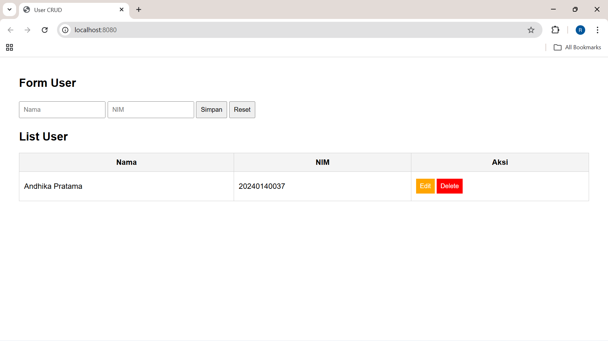

# Laporan Praktikum 7 - Deployment & Docker
**Nama:** Ridha Novita Handayani  
**NIM:** 20240140022  
**Kelas:** D  
**Mata Kuliah:** Deployment

---

## 1. Bukti Docker Desktop
Bagian ini berisi screenshot setelah proses push image ke Docker Hub dan pull image dari teman.

| Keterangan | Gambar                                       |
| :--- |:---------------------------------------------|
| **Image Docker Desktop** |         |
| **Container Docker Desktop** |  |

---

## 2. Website Pribadi (Run from Docker)
Bukti aplikasi saya berjalan lancar di dalam container.

| Fitur | Screenshot                             |
| :--- |:---------------------------------------|
| **Halaman Form** |  |

---

## 3. Website Teman (Pull & Run)
Bukti saya berhasil melakukan pull dan menjalankan image milik teman.

| Fitur | Screenshot                            |
| :--- |:--------------------------------------|
| **Halaman Form Teman** |  |

---